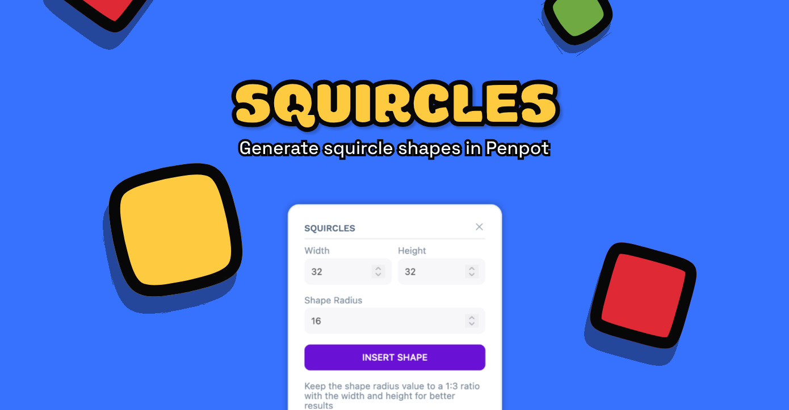

# Squircle Penpot Plugin

Generate squircle shapes for your designs!

# Install on Penpot

Open the plugins modal in your Penpot project and add the next url

- https://penpot-squircle-plugin.netlify.app/manifest.json

Click install and you're setup!
